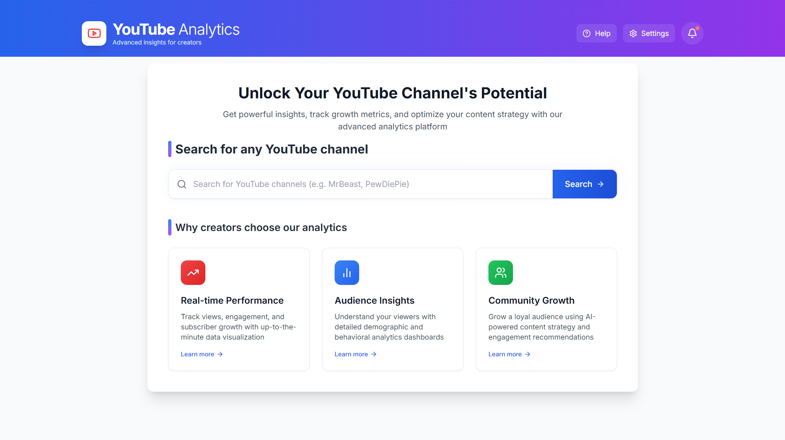

## 📊 Comprehensive Analytics for Content Creators



A powerful, modern dashboard for YouTube content creators to analyze channel performance, track growth metrics, and optimize content strategy with advanced visualizations and actionable insights.

---

## 📑 Table of Contents

- [Overview](#-overview)
- [Features](#-features)
- [Technical Architecture](#-technical-architecture)
- [Installation](#-installation)
- [Configuration](#-configuration)
- [Core Components](#-core-components)
- [API Integration](#-api-integration)
- [Metrics & Calculations](#-metrics--calculations)
- [Usage Examples](#-usage-examples)

---

## 🔍 Overview

YouTube Analytics Dashboard is a Next.js application that provides content creators with comprehensive insights into their channel performance. The dashboard aggregates data from the YouTube API and presents it in an intuitive interface with interactive charts, performance metrics, and actionable recommendations.

This application helps creators:
- Understand audience engagement patterns
- Track growth metrics over time
- Compare video performance
- Identify content strengths and improvement areas
- Monitor channel health through a rating system

---

## ✨ Features

### 1. Channel Search & Selection
- Search for any YouTube channel by name
- View basic channel information with thumbnails
- Access recently viewed channels

### 2. Channel Overview
- At-a-glance metrics (subscribers, views, videos)
- Channel rating system (A+ to D-) based on performance metrics
- Publication date and engagement statistics
- Topics and keywords analysis

### 3. Latest Videos Analytics
- List of recent videos with performance indicators
- Detailed video statistics
- Comments analysis
- Engagement metrics comparison

### 4. Performance Visualizations
- Interactive time-series charts for views, likes, comments, and engagement
- Top videos by views and engagement ratio
- Video category distribution
- Channel performance radar chart comparing multiple metrics

### 5. Related Channels
- Explore channels featured by the selected creator
- Quick navigation between related channels

---

## 🔧 Technical Architecture

### Tech Stack
- **Frontend Framework**: Next.js 13+ with App Router
- **Language**: TypeScript
- **Styling**: Tailwind CSS
- **Data Visualization**: Recharts
- **Animations**: Framer Motion
- **Icons**: Lucide React
- **API Integration**: YouTube Data API v3

### Project Structure
```
youtube_dashboard/
├── app/                    # Next.js application routes
│   ├── page.tsx            # Home/landing page with search
│   ├── channelinfo/        # Channel details page
│   │   └── page.tsx        # Channel analytics view
│   └── layout.tsx          # Root layout
├── components/             # Reusable components
│   ├── ChannelSearch.tsx   # Channel search functionality
│   ├── ChannelActivity.tsx # Video list and activity
│   ├── ChannelGraphs.tsx   # Data visualization components
│   ├── types.ts            # TypeScript interfaces
│   └── utils.ts            # Utility functions & calculations
├── services/               # API services
│   └── youtubeApi.ts       # YouTube API integration
├── public/                 # Static assets
└── package.json            # Dependencies and scripts
```

---

## 🚀 Installation

### Prerequisites
- Node.js 18.0 or higher
- npm or yarn
- YouTube API key

### Setup Steps

1. **Clone the repository**
   ```bash
   git clone https://github.com/yourusername/youtube-dashboard.git
   cd youtube-dashboard
   ```

2. **Install dependencies**
   ```bash
   npm install
   # or
   yarn install
   ```

3. **Create environment variables**
   Create a `.env.local` file in the root directory:
   ```
   YOUTUBE_API_KEY=your_youtube_api_key_here
   ```

4. **Start the development server**
   ```bash
   npm run dev
   # or
   yarn dev
   ```

5. **Access the application**
   Open [http://localhost:3000](http://localhost:3000) in your browser

---

## 📦 Core Components

### 1. ChannelSearch Component

The search interface for finding YouTube channels. It includes:
- Search input with real-time feedback
- Results display with channel thumbnails and basic info
- Error handling for failed searches
- Animations for a smooth user experience

```tsx
<ChannelSearch 
  onChannelSelect={handleChannelSelect} 
  headingText="Search for any YouTube channel"
  onResultsChange={handleSearchResultsChange}
/>
```

### 2. ChannelActivity Component

Displays a list of the channel's videos with detailed statistics and engagement metrics:
- Video thumbnails and titles
- View counts, likes, and comments
- Publication dates
- Interactive elements for viewing comments
- Video performance indicators

```tsx
<ChannelActivity channelId={channelId} />
```

### 3. ChannelGraphs Component

Contains all data visualization elements for channel analytics:
- Performance trends over time
- Video comparison charts
- Top videos by views and engagement
- Category distribution
- Channel metrics radar chart

```tsx
<ChannelGraphs videoData={videoData} channelMetrics={channelMetrics} />
```

### 4. Channel Rating System

A comprehensive rating system that evaluates channel performance on a scale from A+ to D- based on multiple metrics:
- Subscriber conversion rate
- Channel activity ratio
- Audience retention strength
- Growth momentum
- Content efficiency

The rating appears as a badge overlapping the channel thumbnail and includes a tooltip with details on calculation methodology.

---

## 🔌 API Integration

The application uses a structured approach to interact with the YouTube Data API:

### Key API Endpoints Used

1. **Search API**
   - Used for finding channels by name
   - Returns basic channel information and IDs

2. **Channels API**
   - Retrieves detailed channel statistics
   - Gets customization settings, topics, and keywords

3. **Search + Videos API**
   - First searches for videos from a channel
   - Then gets detailed statistics for those videos

4. **ChannelSections API**
   - Retrieves featured/related channels

5. **CommentThreads API**
   - Gets comments for specific videos

### Data Processing

All API responses are transformed into strongly-typed data structures:
- Raw API data → Type-safe interfaces
- String numbers → Parsed integers
- ISO dates → Formatted readable dates
- Nested data → Flattened for easier consumption

Example of formatted video data:
```typescript
export interface FormattedVideoData {
  id: string;
  title: string;
  publishedAt: string;
  description: string;
  tags: string[];
  categoryId: string;
  viewCount: number;
  likeCount: number;
  favoriteCount: number;
  commentCount: number;
  topicCategories: string[];
  hasPaidProductPlacement: boolean;
}
```

---

## 📈 Metrics & Calculations

The dashboard calculates several key metrics to evaluate channel performance:

### 1. Subscriber Conversion Rate
Measures how effectively a channel converts viewers to subscribers.
```typescript
calculateSubscriberConversionRate(channel: FormattedChannelInfo): number {
  return (channel.subscriberCount / channel.viewCount) * 1000;
}
```

### 2. Channel Activity Ratio
Evaluates how active a channel is based on video publishing frequency.
```typescript
calculateChannelActivityRatio(channel: FormattedChannelInfo): number {
  const channelAgeInDays = (new Date().getTime() - new Date(channel.publishedAt).getTime()) / (1000 * 3600 * 24);
  return channel.videoCount / channelAgeInDays;
}
```

### 3. Audience Retention Strength
Measures how well a channel retains its audience.
```typescript
calculateAudienceRetentionStrength(channel: FormattedChannelInfo): number {
  const avgViewsPerVideo = channel.viewCount / channel.videoCount;
  return (avgViewsPerVideo / channel.subscriberCount) * (1 + (channel.videoCount / 100));
}
```

### 4. Channel Growth Momentum
Assesses the growth rate of a channel.
```typescript
calculateChannelGrowthMomentum(channel: FormattedChannelInfo): number {
  const channelAgeInDays = (new Date().getTime() - new Date(channel.publishedAt).getTime()) / (1000 * 3600 * 24);
  return (channel.subscriberCount / channelAgeInDays) * (channel.videoCount / 10);
}
```

### 5. Content Subscriber Efficiency
Measures how efficiently a channel's content attracts subscribers.
```typescript
calculateContentSubscriberEfficiency(channel: FormattedChannelInfo): number {
  return channel.subscriberCount / channel.videoCount;
}
```

### 6. Channel Rating
Calculates an overall channel rating from A+ to D- based on weighted metrics.
```typescript
calculateChannelRating(metrics: {
  subscriberConversionRate?: number;
  channelActivityRatio?: number;
  audienceRetentionStrength?: number;
  channelGrowthMomentum?: number;
  contentSubscriberEfficiency?: number;
  channelEfficiencyIndex?: number;
}): {
  rating: string;  // A+ to D-
  color: string;   // Color code for visual representation
  description: string;  // Explanation of the rating
}
```

---

## 💡 Usage Examples

### Searching for a Channel

1. Navigate to the homepage
2. Enter a channel name in the search box (e.g., "MrBeast", "PewDiePie")
3. Browse through search results
4. Click on a channel to view its analytics

### Analyzing Channel Performance

1. View the channel overview with key metrics
2. Check the channel rating badge for quick performance assessment
3. Hover over the rating for a detailed explanation
4. Explore the channel's metrics in the charts section

### Comparing Videos

1. Navigate to the Analytics Graphs tab
2. Use the "Video Performance Comparison" chart to compare metrics across videos
3. Identify top-performing content by views and engagement
4. Analyze trends over time using the "Performance Trends" chart

### Exploring Related Channels

1. Scroll down to the "Related Channels" section
2. Click on any related channel to view its analytics
3. Compare performance between related channels


---

## 👏 Acknowledgements

- [Next.js](https://nextjs.org/) for the React framework
- [Recharts](https://recharts.org/) for data visualization
- [Framer Motion](https://www.framer.com/motion/) for animations
- [Tailwind CSS](https://tailwindcss.com/) for styling
- [Lucide React](https://lucide.dev/) for icons
- [YouTube Data API](https://developers.google.com/youtube/v3) for data integration

---